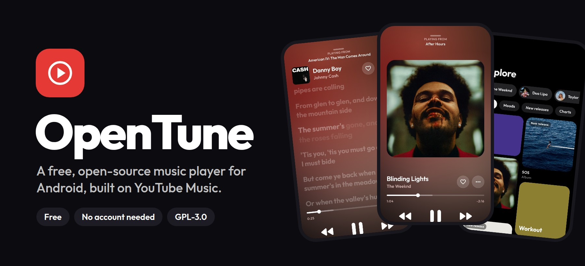
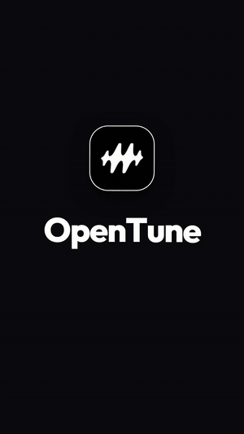
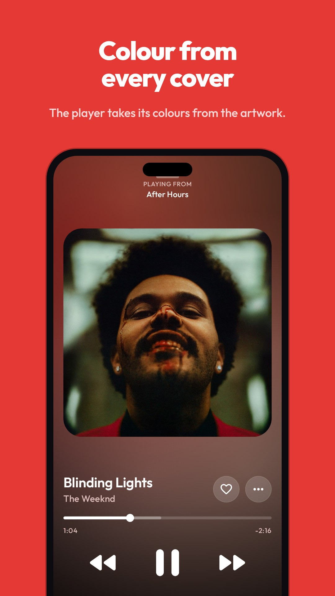
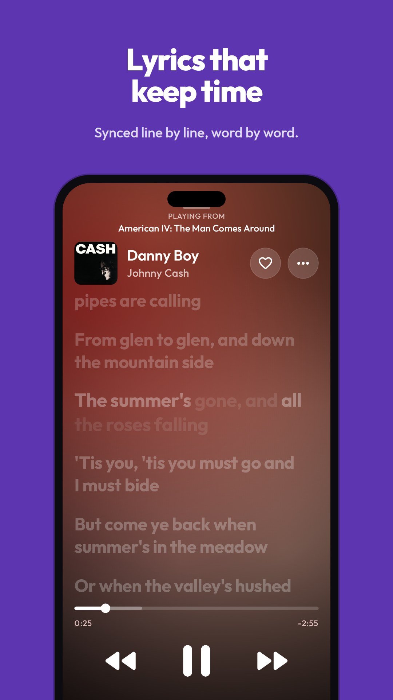
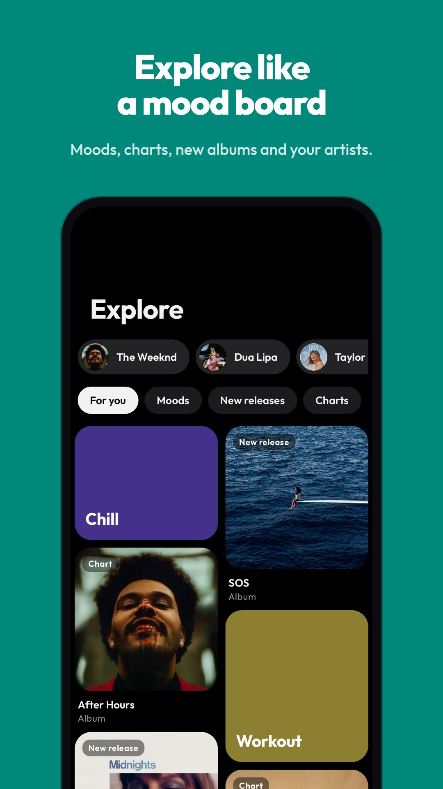
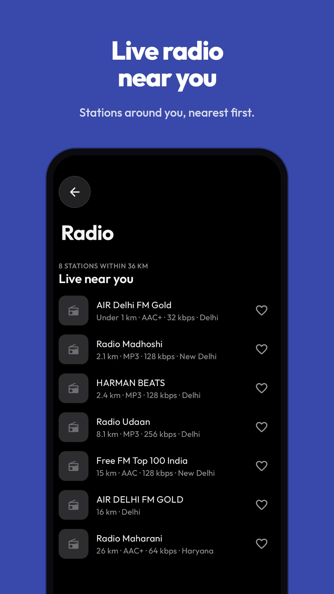
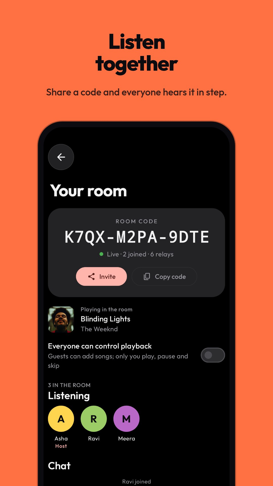
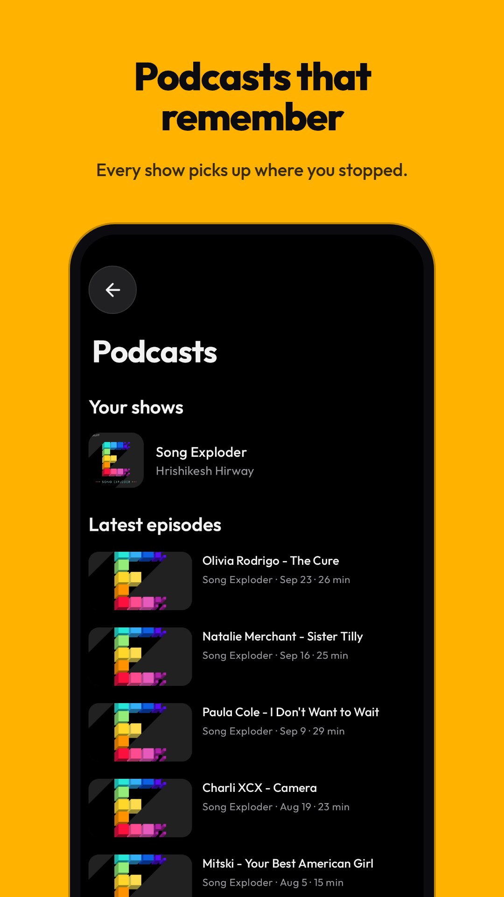

<p align="center">
  
</p>

<p align="center">
  <a href="https://github.com/justshivv/Opentune/releases/latest"><b>Download the latest APK</b></a>
  &nbsp;·&nbsp;
  <a href="https://justshivv.github.io/Opentune/">Website</a>
  &nbsp;·&nbsp;
  <a href="#features">Features</a>
  &nbsp;·&nbsp;
  <a href="#building">Build it yourself</a>
</p>

<p align="center">
  <a href="https://github.com/justshivv/Opentune/actions/workflows/ci.yml"></a>
  
  
  <a href="LICENSE"></a>
</p>

# OpenTune

An Android music player for YouTube Music. It talks to YouTube's internal
("Innertube") API directly, so there's no API key, no account required and
no server of your own. Sign in if you want your likes and playlists.

Built with Kotlin, Jetpack Compose and Media3. Android 8.0 and newer.

## See it

<p align="center">
  <a href="docs/media/opentune-reel.mp4"></a>
  <br>
  <sub><a href="docs/media/opentune-reel.mp4">Watch the 40-second video</a> (MP4, with sound)</sub>
</p>

<table>
  <tr>
    <td></td>
    <td></td>
    <td></td>
  </tr>
  <tr>
    <td></td>
    <td></td>
    <td></td>
  </tr>
</table>

## Install

1. Open the [latest release](https://github.com/justshivv/Opentune/releases/latest)
   and download the APK for your phone. `arm64-v8a` fits almost every phone
   from the last several years; `universal` runs on anything.
2. Open the file and allow your browser or file manager to install apps
   when Android asks.
3. That's it. OpenTune checks this repository for new releases once a day
   and can update itself from Settings.

Each release lists SHA-256 checksums of its APKs in `SHA256SUMS.txt`.

## Highlights

- **No ads in the app, no account, no server.** Signing in is optional and
  only brings your likes and playlists along.
- **Best audio by default**, with crossfade, loudness levelling, a 15-band
  equalizer and AutoEq correction for 8,000+ headphones.
- **Synced lyrics**, lit word by word, that also work offline with downloads.
- **Listen together**: share a room code and friends hear the same song,
  in step, on their own phones.
- **Live radio** from 50,000+ stations, nearest first.
- **Cast** to Chromecasts, smart TVs and network speakers on your Wi-Fi.
- **Name that song**: hold the phone up and it tells you what's playing.
- **Podcasts**, downloads, Android Auto, a home-screen widget and imports
  from Spotify and YouTube playlists.

## Features

### Listening

- **Two stream engines that switch on their own.**
  InnerTubeX leads and
  OpenTune's own client walk backs it up; after a failure the walk leads
  for ten minutes, then InnerTubeX gets its turn back. NewPipeExtractor is
  the last resort. Every stream URL is
  test-fetched before playback, so a dead link fails fast instead of
  spinning. Stats for nerds shows which engine served the track.
- **Best audio by default.** Streams are ranked by how they sound, not by
  raw bitrate, so Opus wins over AAC at a similar rate, on Wi-Fi and mobile
  data alike, with a lower ceiling available per network.
- **Quality upgrade.** A few seconds into a song, OpenTune looks for a
  clearly better copy (your Premium account's 256 kbps streams, or Opus
  when the song started on AAC) and switches to it without stopping. The
  player's "…" menu has "Upgrade quality" to ask on demand.
- **Crossfade** from 1 to 12 seconds, with equal-power curves so the blend
  stays level. Off by default.
- **One steady volume.** Loudness normalization uses YouTube's own
  measurement of each song. Figures are kept on the device, so songs played
  from the cache or from downloads get the same level as fresh ones. A
  volume level sets where songs land: Quiet, Normal (YouTube's reference)
  or Loud, the default, about 5 dB higher with a limiter so peaks don't
  clip. On the phone's own speaker songs are never turned down, only quiet
  ones lifted; headphones and Bluetooth are fully levelled.
- **Your phone's own sound effects.** The audio session is opened to the
  system, so Dolby Atmos, Samsung SoundAlive, the system equalizer and
  similar effects apply to OpenTune the way they do to the stock players.
- **A clean signal path.** With the equalizer and effects off, decoded
  audio goes to the output untouched. When they're on, the app's own DSP
  adds headroom so boosts don't clip. The player's Signal path dialog
  shows every stage: source, engine, DSP, tempo, loudness, device effects,
  the Android mixer's rate, volume and output.
- **Bit-perfect USB output** (Android 14+, optional). A USB DAC gets the
  song at its own rate with no mixing, resampling or effects, through
  Android's bit-perfect mixer. The app applies the volume, and at full
  volume the signal is bit-exact.
- **Clarity** (optional). A tone curve that cuts rumble, firms up the
  bass, clears mud and adds presence and air, with headroom and a soft
  limiter so peaks stay clean.
- **8D audio** (Remix). The music circles your head, slowly, at a medium
  pace or fast: it pans from ear to ear with the small delay and softening
  a sound has when it's beside or behind you. Best with headphones.
- **A sleep timer that winds down.** Over the last few minutes (a third of
  a short timer, at most three) the music fades out and the player
  dims; "End of song" fades the last 15 seconds. A switch in the sleep
  timer turns it off.
- **Fast starts and skips.** Playback begins after half a second of audio.
  The songs either side of the current one are found before you get to
  them, and the next one is buffered while this one plays. Played songs
  stay in a song cache (512 MB by default) for instant replays and seeks.
- **Daily mixes.** Home has mixes made on the phone from what you play,
  new each day: one for each of your top three artists with the songs you
  play around them, one for this time of day, On repeat and Rediscover
  (favourites you haven't played lately). When a mix runs out, autoplay
  carries on.
- **Covers for your playlists.** A playlist made in the app shows four of
  its songs' covers as a collage; with fewer, it gets a soft gradient in
  colours picked from its name, so it always looks the same.
- **Queue and radio.** Autoplay keeps similar songs coming, also after a
  song you started on its own from Home or search. Shuffle,
  repeat, play next, add to queue, swipe-to-queue on any row, and
  drag-to-reorder in the player's queue. Shuffle, repeat and autoplay
  each feel different under your finger (a riffle, a loop closing, a
  swell) and move in their own way as they change.
- **Pick who recommends.** Autoplay and Home's "Because you played" can
  follow YouTube Music's radio, Spotify's recommendations or JioSaavn's
  (Settings → Playback → Recommendations). Spotify's picks come from the
  "Recommended" list on its public song pages, after ListenBrainz's public
  lookup finds the song there; JioSaavn's come from its public
  recommendations. No account or key is needed. Only song names are read,
  each one is found on YouTube Music and plays from there, and when a
  service doesn't know a song, YouTube Music's radio takes over.
- **Sound tools.** A 15-band equalizer (ISO 25 Hz to 16 kHz) with presets,
  tone and balance, bass boost,
  stereo widening, skip silence, USB DAC preference, optional 32-bit float
  output, and a Remix sheet for speed, pitch and reverb (Slowed + reverb,
  Nightcore and more).
- **Headphone correction.** Pick your headphones from AutoEq's 8,000+
  measurements and their parametric correction runs ahead of your own EQ,
  so you start from a neutral sound.
- **Sleep timer.** Stop after 15 to 90 minutes, or at the end of the song.
- **Cast to a TV or speaker.** The Play on button in the player finds
  Chromecasts (and TVs and speakers with Chromecast built in) and DLNA
  renderers (most smart TVs, many network speakers, Kodi, VLC) on the same
  Wi-Fi. No Google libraries are involved: OpenTune speaks the Cast
  protocol and DLNA itself. The phone serves each song to the device from
  a small web server of its own, so downloads, songs on the phone and
  streams all cast. The queue, autoplay, the notification and every button
  keep working as usual; the device follows, and its volume is in the same
  sheet.
- **What's this song?** From Home or the search bar, a page listens
  through the microphone and names the song playing nearby. The phone
  turns a few seconds of sound into an audio fingerprint (the method
  [SongRec](https://github.com/marin-m/SongRec) worked out) and only the
  fingerprint is sent to Shazam's lookup; the recording stays on the phone.
  While it listens, a glowing button sends rings out and ripples with the
  sound. What it finds can be played straight away and stays in a Found
  lately list. The microphone is only asked for when you use it.
- **SponsorBlock.** Music videos skip the parts viewers have marked as
  non-music (talking, skits), sponsor reads, self-promotion and like or
  subscribe reminders, using [SponsorBlock](https://sponsor.ajay.app)'s
  segments. Choose the categories in Settings. Only a 4-character hash of
  the video id is sent.
- **Headphones and volume** (optional, off by default). Playback can carry
  on when headphones are plugged in or a Bluetooth device connects, and
  pause when the volume is turned all the way down, playing again when it
  comes back up.
- **Podcasts.** A tab of its own: search shows or episodes, browse
  topics, popular episodes and shows to try from YouTube Music, and show
  pages with every episode. Subscribe to shows (kept on the phone, no
  account needed) to see their newest episodes up top. Episodes pick up
  where you stopped, with "Continue listening" for the ones in progress
  and a played mark for the ones finished.
- **Internet radio.** 50,000+ live stations from
  [Radio Browser](https://www.radio-browser.info), the free community
  directory: stations near you, your country's most played, worldwide
  favourites, genres and search. "Near you" uses approximate location,
  only when you ask, sends Radio Browser a position rounded to about a
  kilometre and keeps nothing; it lists stations nearest first with how far
  away they are, then stations listed for your city or state that have no
  map location (often the public broadcaster's FM channels), with the FM
  frequency when the name carries one. Stations the directory lacks can be
  added by stream address, or suggested to Radio Browser. The song on air shows in the player and notification when
  the station sends it. Favourite stations are in Android Auto too.
- **Listen together.** Start a room and share its code; friends who join
  hear what you play, in step, each phone streaming the music itself. Guests
  can add songs to the room's queue and chat, and the host can let everyone
  play, pause, seek and skip. Pausing without control pauses just for you;
  "Catch up" puts you back in step. Rooms run over public Nostr relays with
  no account or server: messages are encrypted with a key from the room
  code and sent as ephemeral events that relays don't keep. Invites open
  with an `opentune://together/<code>` link or by typing the code.
- **Picks up where you left off.** The queue, song and position come back
  at launch, paused, without fetching anything until you press play.
- **Home-screen widget.** Cover, title and artist, with previous,
  play/pause, next and like. Play on the widget, or on a Bluetooth headset,
  starts the saved queue even after the app was closed.
- **Like and shuffle in the notification.** Both sit in the media
  notification's extra buttons and in Android Auto, and stay in step with the
  app.
- **Android Auto.** Browse Home, Recent and Library (Liked, Downloads,
  playlists, radio stations) on the car screen, search by typing or voice ("play … on
  OpenTune"), and tap a song to play its list from there. Sideloaded
  builds show up in Android Auto once "Unknown sources" is turned on in
  Android Auto's developer settings.
- **Opens YouTube links.** music.youtube.com, youtube.com and youtu.be
  links, or links shared to the app, open in OpenTune.

### Library and account

- **Sign in to YouTube Music** on Google's own page inside the app. Likes
  sync to the account, your playlists show in Library, and Home turns
  personal. The login cookie stays in app-private storage and is left out
  of backups.
- **Downloads** for offline listening, with a quality setting and Wi-Fi
  only by default. They keep going after the app is closed. Every
  playlist and album has Download all, which counts its way through and
  ends with a little run of taps.
- **Add songs to your playlists** from the playlist itself: search, or
  pick from what you played lately, and tap + on each one.
- **Library:** a card for your year so far (minutes, plays, top song and
  artist) that opens your Wrapped, shortcuts to Liked, Downloads, On this
  phone and Replay, your playlists from the app and from YouTube in one
  list, and the last five songs you played, with the rest behind
  "Show all".
- **Replay:** top songs, artists and albums from this device's history.
- **Wrapped:** your listening as a quiet animated story. Each page is a
  flat field of colour with one large shape drifting slowly on it (a low
  sun, a wave, nested arcs, a grid of dots) under a fine film grain, with
  the numbers set large in a serif and headlines that ink in from the
  left. A new page opens as a circle growing from where you tapped. The
  intro scatters your top covers like prints, and the top artist and top
  song pages take their colours from the cover. Minutes listened, top artist and top five, top song and top five, what
  part of the day you listen most, your biggest month and day, your
  longest streak, the song you played most in one day and the one it all
  started with, then a summary card with Play, Shuffle and Share, which
  sends your Wrapped as a story-sized poster. Covers this
  year, the last 30 days or all time. Tap to go on, tap the left side to
  go back, hold to pause.
- **Your own music server** (optional): Navidrome, Gonic, Airsonic,
  Nextcloud Music or any Subsonic-compatible server. Browse recently added
  and most played albums, artists and playlists, search, and play songs
  as they're stored, so FLAC and hi-res files stay lossless. Also in
  Android Auto. Only a sign-in token is kept, never the password, and it's
  left out of backups.
- **ListenBrainz** (optional): send what you play to your open
  ListenBrainz history with your user token, and get its recommendations
  as a shelf on Home.
- **Album covers from MusicBrainz**: for music videos and local files
  without art, the player shows the album's cover from the Cover Art
  Archive instead of a video frame, when MusicBrainz has a confident match.
- **Last.fm scrobbling** (optional), with your own free Last.fm API key.
  The password is only used once to get a session and isn't stored.
- **Import playlists.** Settings › Import a playlist takes:
  - a **YouTube Music or YouTube playlist link**, read in full however long
    it is, and saved as a playlist on the phone (or played straight away);
  - a **Spotify playlist, album or song link**, pasted or shared to
    OpenTune from the Spotify app, with no sign-in. Each song is looked up
    on YouTube Music and the closest catalogue match kept, with misses
    listed. A song link plays straight away. Without signing in, Spotify
    only shows a playlist's first 100 songs;
  - **Export from Spotify**, for every song of any playlist or your Liked
    Songs: [Exportify](https://exportify.app) opens inside OpenTune, you
    sign in with Spotify there and tap Export (or Export All), and the
    playlist comes straight back ready to import, with no file to find.
    A CSV from Exportify, TuneMyMusic, Soundiiz and others can also be
    picked from the phone; columns are found by their headers.

  Nothing streams from Spotify.
- **New-release alerts.** Follow an artist from their page (no account
  needed) and a notification tells you when they put out an album or
  single. Checked twice a day.
- **Hide explicit content** (optional): songs and albums YouTube Music
  marks explicit are left out of Home, search, album and artist pages,
  autoplay and radio. Tracks the catalogue doesn't label still show.
- **Set as ringtone.** A downloaded song or a file on the phone can be the
  ringtone, notification sound or alarm. A downloaded song is copied to
  Ringtones/OpenTune first, since the system can't read app storage.
- **Export and import** of settings, history, likes and playlists as JSON.
- **Updates in the app.** OpenTune checks this repository's GitHub releases
  every few hours: whenever the app comes to the front, hourly while it's
  open, and twice a day in the background, with a notification when a new
  version is out (or whenever you ask). When GitHub's API is over its
  hourly limit, which happens often on mobile data where many phones share
  one address, the latest release is read from the releases page instead.
  It downloads the APK for your phone's processor, checks it against the release's SHA256SUMS and hands it to
  Android's installer. Android only installs an update signed with the same
  key as the installed app.

### Look and feel

- **An opening that dives into the logo.** At start the mark takes over
  from the system splash at the same size, settles with a glint of light,
  then turns into a window onto the app, outlined in white so it shows
  even over a dark app, and rushes toward you until the app fills the
  screen. Off under Settings › Motion, and
  skipped with reduced motion.
- **Liquid Glass.** The floating bars and player buttons frost and bend
  what's behind them, like Apple's material (Android 13 and newer; frosted
  glass below that, solid with "Reduce dynamic blur"). The glass blurs the
  real page as it scrolls under it, not a flat colour. Album, playlist and
  artist pages get a frosted top bar once the header scrolls away, which
  fades out softly below the bar instead of ending in a line, and popup
  sheets let the phone's blur of the screen behind show through.
- **Moving cover art.** In the player the cover drifts and zooms slowly
  while the song plays and settles when you pause; it works on the
  full-screen cover too. It's made from the cover itself, so it works for
  every song. Off in Settings, or with reduced motion.
- **Pull to refresh with the logo.** On Home and Podcasts, pulling down
  brings in the OpenTune mark and fills it with the playing song's colours
  from left to right while the page follows your finger with some give; past the line
  it ticks and pops, while it loads the mark sways like a sound wave with
  light running across it, and when it's done it shrinks away.
- **Skeleton loading.** Pages show the shape of what's coming while they
  load, with one soft band of light sweeping across every placeholder.
- **A dock that gets out of the way.** Home, Explore, Podcasts and Library
  sit in a floating glass pill, each an icon over its name; a soft lens of
  the accent colour slides to the open one and its icon fills in. Search
  has its own round button beside the pill. The now-playing card above
  takes its tint from the cover and has the play button inside a progress
  ring. Scroll down and the dock tucks away while the card shrinks into a
  round cover bubble in the corner, still ringed by progress; scroll up and
  both come back. Pick how the dock goes: Minimize (like iOS 26, the
  default: the dock pill contracts to the left into a circle holding the
  open tab, the other tabs slipping under its edge, with the song in a
  slim bar beside it), Bubble, Glide (off the bottom and back on
  a spring), Retract (into the Search button and unrolling from it) or
  Cascade (tabs drop one by one and return in a wave). The lens can
  Stretch like a drop, wobble like Jelly or Glide in one piece.
- **Glass styles.** The dock, buttons and bars come in Frosted, Clear,
  Heavy frost, Tinted (washed with the accent) or Smoke, for Liquid Glass
  and frosted glass alike, or Liquid: Apple's clear glass, hardly frosted,
  with a deep lens at the edges that bends and splits the light, vibrant
  colour through it, a bright specular rim and a soft inner shade
  (Android 13 and newer). Pages also blur and fade as they scroll under
  the status bar; that's a switch of its own.
- **Motion to taste.** Pages can Slide, Fade, Zoom or Rise into view, and
  the player can open on a Spring, a Smooth glide, a Bouncy overshoot or
  Snappy. On phones with 90 or 120 Hz screens the app asks for the fastest
  rate, which can be turned off to save battery.
- **Its own typeface.** Every screen is set in Outfit.
- **Home greets you** by the time of day and your name, with your avatar
  leading to settings. Below YouTube Music's own shelves it adds a radio
  of your last song, albums, singles and similar artists for the artists
  you play most, new releases, the charts, Explore, and playlists for a
  couple of moods that change daily.
- **Explore as a board.** Pills for artists to jump to (the ones you play
  most first, then the charts' top artists), chips to narrow it to moods,
  genres, new releases or charts, and a two-column board of mood cards,
  new albums and chart playlists at different heights, Pinterest-style.
- **An Apple Music-style player.** Cover, lyrics and queue modes, heart and
  "…" buttons, the current lyric line under the title, the artist name
  opening their page, time remaining,
  large back/play/forward controls, a shuffle/repeat/autoplay pill, and the
  name of the output device. Drag it down and it shrinks into a card
  before it closes.
- **Lyrics that rise into place.** Opening the lyrics slides them up on a
  soft spring and brings them into focus from a blur while the cover sinks
  back; closing them brings the cover forward again.
- **Synced lyrics** from [LRCLIB](https://lrclib.net) (word by word where
  it has the timing), KuGou (line-synced, strong on Asian music), NetEase
  Cloud Music (line-synced, a large catalogue), Unison (the community
  lyrics of [Better Lyrics](https://github.com/better-lyrics/better-lyrics),
  often word by word; entries its users voted down are skipped), a music
  video's own hand-made captions (timed to the video, as Better Lyrics
  finds them) and YouTube Music (unsynced), in an order you set, each
  credited under the lyrics. Plain
  text never ends the search: every source is asked until one has the
  song in time, a busy LRCLIB is asked again, and plain lyrics found while
  a source was down are looked up again a little later. Eight animation
  styles (Fluid, Karaoke, Slide, Focus zoom, Minimal, and three where the
  words themselves move: Bounce, Pop and Reveal), a per-song timing
  offset, adjustable text size, left or centred lines, an optional glow on
  the sung line, and lyrics saved with downloads so they work offline.
- **Lyric cards.** The quote button in the lyrics opens a sheet where you
  pick up to five lines and share them as a picture: over the blurred
  cover, in the cover's colour, or on a light page.
- **Lyrics while seeking.** Drag the seek bar and the line sung at that
  spot shows above your finger (Settings › Player).
- **One song menu everywhere:** round buttons up top for like, download,
  add to playlist and share, then play next, add to queue, start radio,
  view artist, open album, convert to the music video, and dislike (kept
  out of autoplay); plus upgrade quality,
  signal path, sleep timer, lyrics offset and copy log in the player.
- **Player layouts:** Classic; Vinyl, where the cover turns as a record
  while the song plays; Lyrics first, with a small cover on top and the
  lyrics taking the rest; Minimal, with just the cover, title, seek bar
  and controls; Cassette, a tape whose reels turn and wind from one side to
  the other as the song goes on; Halo, a round cover in a ring of moving
  bars; and Polaroid, the cover as an instant photo that sways gently.
- **Wavy seek bar** (optional) that ripples while music plays.
- **Waveform seek bar** (optional): the bar shows the song's loud and
  quiet parts. Downloaded songs and songs on the phone are read in the
  background and show the whole shape at once; streamed songs fill it in
  as they play and keep it, so it's complete the next time.
- **Quick screens.** Home opens on the last copy saved while the fresh one
  loads; pages you've visited and searches you've made come back at once
  and refresh in the background.
- **iOS-style bounce** at the ends of every list.
- **Smooth tab changes.** The dock's highlight stretches toward the tab
  you pick and settles into it, without overshooting.
- **Landscape player.** Turn the phone on its side and the cover fills
  the left; the right shows where the sound is going, the song, a slim
  time bar, the line being sung and the next ones in a serif, the
  controls with like and output buttons, and the volume, all over a
  blurred, dimmed cover. Lyrics and the queue open in the cover's place.
- **Share with a picture.** Sharing a song sends its link with a square
  image: the cover blurred into the background and, in the middle, the
  cover in a dark rounded frame with the artist's photo and name at the
  top, a share button and a heart, and the title, the time, a progress bar
  and the controls over its foot.
- **Player buttons in four designs.** Bloom: big bare glyphs, a soft disc
  of light blooming behind each press. Capsule: play in an accent pill
  that stretches wide while music plays, between skip buttons that tilt
  toward where they go. Orbit: play inside the song's progress ring with a
  comet of light circling it, and an arc that spins round a skip button
  when tapped. Morph: a round button that ripples into a slowly turning
  wavy shape while music plays, its outlined triangle folding into two
  outlined bars, with skips that ripple when tapped. In all four, play
  folds into pause and the skip arrows roll a step on with each tap.
- **Song change.** The cover can Fade into the next, slide past in a
  Carousel in the direction you skipped, Flip over like a card, drop onto
  a Deck while the old one sinks under it, Zoom through as the old one
  rushes past you, Dissolve from one blur into the other, turn like a
  Cube, open out of the middle in a Reveal, or Toss the old one aside as
  the new one lands. It applies to the full-screen cover too.
- **Covers that fly.** Tap a song and its cover lifts off, tilts and arcs
  down into the now-playing card. Off under Settings › Motion.
- **Double-tap the cover** on either side to go back or ahead 10 seconds;
  taps in a row add up, with a ripple and the total on the cover.
- **A glow under the cover** in its own colours, which swells with the
  bass (Settings › Player › Cover art).
- **A burst of hearts.** Liking a song in the player throws small hearts
  and sparks out in the cover's colours.
- **Lyrics in colour.** The cover's colours drift slowly behind the
  lyrics while they're open.
- **Blurred headers.** Album, artist and playlist pages have their cover
  blurred and stretched behind the top, fading into the page; artist photos
  stay sharp at the top and melt into the blur below.
- **What's new.** After an update, a short sheet lists what changed, once.
- **Ambient light.** With the Gradient player background, wide soft
  glows in the song's colours drift slowly under the controls, meeting and
  mixing over a pale wash at the foot of the screen, and lift a little
  with the music. The level is read from the app's own audio as it plays,
  so no microphone permission is needed.
- **A player you can feel.** Play swells into a deep thump, pause thumps
  and fades, next rushes forward into a kick, previous kicks and pulls
  back, a like beats twice like a heart, and dragging the seek bar ticks
  past each tenth of the song. These stay strong even on a light setting.
- **Haptic feedback you can tune**, from off to strong. Taps use the phone's
  crisp haptic primitives where it has them, and follow the system's touch
  feedback switch.
- **Themes:** light, dark or system, Material You, accent colors, palette
  styles, pure black, color from artwork, and reduced motion and blur.

YouTube's audio is lossy, so there's no lossless or Dolby Atmos stream
option from YouTube; lossless comes from your own music server. OpenTune
doesn't unlock JioSaavn streams with a hard-coded key, doesn't fetch Tidal,
Qobuz, Deezer or DAB audio through relay servers or decrypt Deezer
streams, doesn't use scraped Apple Music, Tidal or Spotify tokens for
animated "Canvas" covers, and doesn't take lyrics from Apple Music, Spotify
or Musixmatch through proxies or scraped secrets. Those depend on getting
around a service's protection or terms, so they stay out.

Not built yet: lyric translation and an in-app language setting.

## Usage counts

To know how many people use it, OpenTune adds one, anonymously, to a few
public counters on [Abacus](https://abacus.jasoncameron.dev), a free
counting service: once when it's first used, once per version, the first
time it's used each day, week and month, and once per song played. No ID
is sent, no song names and nothing about you; the counter only learns that
some phone was here (like any web request, the service sees an IP
address). Each phone remembers what it has counted so it never adds itself
twice to the same day. Turn it off under Settings › About › Count this
phone in usage numbers. Debug builds never count.

## Building

Open the repository in Android Studio, or build from the command line:

```
./gradlew assembleDebug        # app/build/outputs/apk/debug/app-<abi>-debug.apk
./gradlew assembleRelease      # app/build/outputs/apk/release/app-<abi>-release.apk
./gradlew testDebugUnitTest    # unit tests
./gradlew lintDebug            # lint
```

Each build makes one APK per processor type (`arm64-v8a` for most phones,
`armeabi-v7a`, `x86_64`) and a `universal` one that runs anywhere. Release
builds go through R8, which only removes unused code: nothing is renamed,
so crash logs stay readable (see `app/proguard-rules.pro`).

You need JDK 17 or newer (CI uses 21) and an Android SDK with platform 37
(InnerTubeX is compiled against it; the app targets 36), set through
`ANDROID_HOME` or `local.properties`.

### CI and releases

GitHub Actions builds, tests and lints every push (`.github/workflows/ci.yml`)
and keeps the release APKs as an artifact. Pushing a tag such as `v0.2.0`
builds signed APKs and publishes them as a GitHub release
(`.github/workflows/release.yml`). Release signing uses the repository
secrets `OPENTUNE_KEYSTORE_BASE64`, `OPENTUNE_KEYSTORE_PASSWORD`,
`OPENTUNE_KEY_ALIAS` and `OPENTUNE_KEY_PASSWORD` when they're set, and the
debug key otherwise. Set the secrets before the first release: the in-app
updater can only install a release signed with the same key as the copy
already on the phone, and a CI runner's debug key changes from run to run.

## Project layout

```
app/src/main/java/com/opentune/
  data/innertube/   Innertube client and parser, StreamResolver (engine switch),
                    InnerTubeXResolver, PoToken WebView
  data/             account, downloads, library, history, lyrics, loudness, settings
  playback/         PlaybackService (ExoPlayer, cache, loudness, upgrade, sleep timer),
                    Crossfade, DSP
  ui/               Compose screens: home, explore, search, library, player, settings
docs/               README banner, screenshots and the 30-second video
```

The README's screenshots are drawn from the app's own screens by
`ReadmeScreenshotTest`, which runs when `OPENTUNE_SHOT_ART` points at a
folder of cover images (they aren't kept in the repository).

## Disclaimer

The screenshots and video show real albums, artists and songs to show the
app as it's used. Cover art, names and recordings belong to their owners.
OpenTune isn't affiliated with or endorsed by YouTube, Google, Spotify or
any artist or label shown.

## License

OpenTune is licensed under the GNU General Public License v3.0. See
[LICENSE](LICENSE). Code, libraries, fonts and data from other projects
are listed in [THIRD_PARTY_NOTICES.md](THIRD_PARTY_NOTICES.md), as their
licences require.
